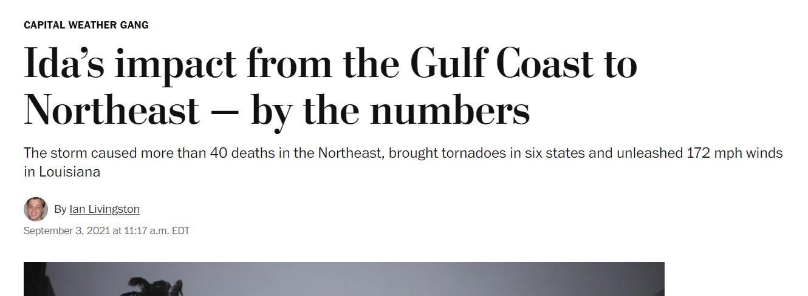
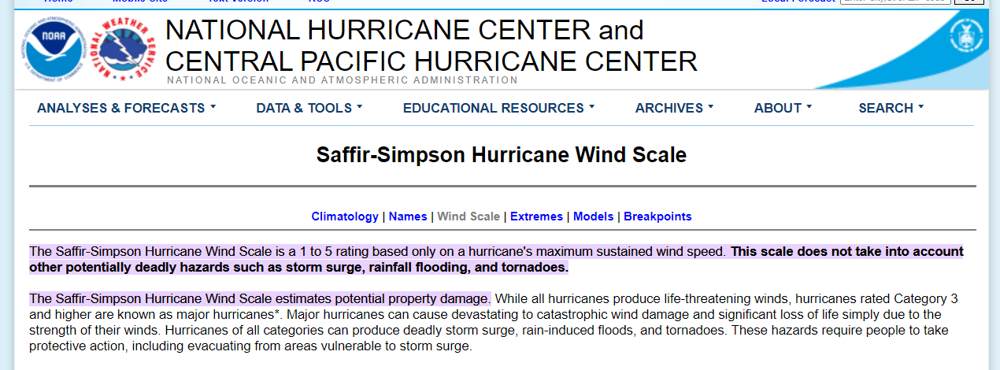

```{r setup, include=FALSE}
knitr::opts_chunk$set(echo = TRUE)
library(tidyverse)
```

## Hurricane Ida



## Saffir-Simpson Wind Scale



## Proposed Hierarchical Bayesian Model

The following hierarchical Bayesian model was proposed to predict the wind speed of the $i^{th}$ hurricane at time $t+6$:

$$
 Y_{i}(t+6)=\beta_{0, i}+\beta_{1, i} Y_{i}(t)+\beta_{2, i} \Delta_{i, 1}(t)+\beta_{3, i} \Delta_{i, 2}(t)+\beta_{4, i} \Delta_{i, 3}(t)+\varepsilon_{i}(t),   
$$

where $Y_{i}(t)$ is the wind speed at time \textit{t}, $\Delta_{i, 1}(t)$,  $\Delta_{i, 2}(t)$, $\Delta_{i, 3}(t)$ are the changes in latitude, longitude, and wind speed between times $t$ and $t-6$, $\varepsilon_{i}(t)$ is the random error associated with each $Y_{i}(t+6)$

We want to estimate the random coefficients, $\beta_i = (\beta_{0, i}, \beta_{1, i}, \beta_{2, i}, \beta_{3, i}. \beta_{4, i})$, for each hurricane. 

## Assumed Prior Distributions

The prior distributions for each of these parameters are assumed to be as follows: 

\begin{align*}
     &\epsilon_{i}(t) \sim N(0, \sigma^{2}) , \text{ which are independent across $t$}\\
     &P\left(\sigma^{2}\right) \propto \frac{1}{\sigma^{2}}\\
     &P(\boldsymbol{\mu}) \propto 1\\
     &P\left(\Sigma^{-1}\right) \propto|\Sigma|^{-(d+1)} \exp \left(-\frac{1}{2} tr(\Sigma^{-1})\right),
        \\
     &\quad\quad\text{ where $d$ is the dimension of $\beta_i$}\\
     &\beta_{i} \sim MVN(\mu, \Sigma)\\
\end{align*}

## Goals

1. Construct an MCMC algorithm from which we can sample from a posterior distribution to estimate $\Theta = (\bf{B}, \bf{\mu}, \sigma^2,$ $\Sigma)$.

2. Conduct analysis using estimated parameters to understand their properties.

    a. Seasonal changes in any of the coefficients

    b. Predictive influence of these coefficients on forecasting hurricane impact. 
    

# MCMC

## Data 

**ID**: ID of hurricanes

**Year**: In which the hurricane occurred

**Month**: In which the hurricane occurred

**Nature**: Nature of the hurricane

- ET: Extra Tropical
- DS: Disturbance
- NR: Not Rated
- SS: Sub Tropical
- TS: Tropical Storm

**Time**: dates and time of the record

**Latitude** and **Longitude**: The location of a hurricane check point

**Wind.kt**: Maximum wind speed (in Knot) at each check point

## MCMC for Hierarchical Bayesian Model:Data Partition
**Data Partition**

- For each hurricane, 80% of records were randomly assigned to the training set and the remaining 20% were assigned to testing set. 

- Hurricanes with less than 7 records were removed: at least 5 observations are included in the training set and 1 observation is included in the testing set.

## MCMC for Hierarchical Bayesian Model: Method
**Distribution Derivation:**

- Gibbs sampler is used to generate random variables from given distribution:

- Let $\Theta = (\boldsymbol B^{T}, \boldsymbol \mu^{T}, \boldsymbol \sigma^{2}, \boldsymbol \Sigma)$, the posterior distribution can be written as:

$$
\begin{aligned}
P(\Theta \mid Y) &\propto f(Y | \Theta)P(\Theta) \\
&= f(Y \mid \boldsymbol B, \boldsymbol \mu, \sigma^2, \boldsymbol \Sigma) 
f(\boldsymbol B \mid \boldsymbol \mu, \boldsymbol \Sigma)P(\boldsymbol \mu) P(\sigma^2) P(\boldsymbol \Sigma^{-1})
\end{aligned}
$$

## MCMC for Hierarchical Bayesian Model: Method
**Posterior Distribution of $\Theta$:**

- $Y_i \sim MVN( X_i\beta_i^T , \sigma^2 I_{n_i})$ , where $n_{i}$ is the number of observation of the $i^{th}$ hurricane.

$$
\begin{aligned}
 f(Y \mid \boldsymbol B, \boldsymbol \mu, \sigma^2, \boldsymbol \Sigma) &= \prod_{i = 1}^N f(Y_i | B, \mu, \Sigma, \sigma^2)\\
 &= \prod_{i=1}^N(2\pi)^{-\frac{n_i}{2}} \left| \sigma^2I_{n_i} \right|^{-\frac{1}{2}}\exp(-\frac{1}{2}(Y_i - X_i \beta_i^T)^T ( \sigma^2 I_{n_i})^{-1}(Y_i - X_i \beta_i^T)) \\
\end{aligned}
$$

- $\beta_i \sim \text{MVN}(\mu, \Sigma)$:

$$
\begin{aligned}
    f(B | \mu, \Sigma) &= \prod_{i=1}^N (2 \pi)^{-\frac{5}{2}} \left| \sigma \right|^{-\frac{1}{2}} \exp\left( -\frac{1}{2} (\beta_i - \mu)^T \Sigma^{-1} (\beta_i - \mu)\right)
\end{aligned}
$$


## MCMC for Hierarchical Bayesian Model: Method
**Posterior Distribution of $\Theta$:**

- the posterior distribution of $\Theta$, where $A = \Sigma^{-1}$ :

$$
\begin{aligned}
 P(\Theta \mid Y) \propto & \\
 & \sigma^{-\sum_{i=1}^N n_i - 2}|A|^{d + \frac{N}{2}+1} \\
 & \exp\left[-\frac{1}{2}\sum_{i=1}^N \left[(Y_i - X_i\beta_i^T)^T(\sigma^2I_{n_i})^{-1}(Y_i - X_i\beta_i^T) + (\beta_i - \mu)^T A(\beta_i - \mu)\right]\right. \\ 
 & \left. -\frac{1}{2} tr(A) \right] \\
\end{aligned}
$$


## MCMC for Hierarchical Bayesian Model: Method
**Conditional Distribution of each parameter:**

- $\beta_i \sim MVN(V^{-1}M,V^{-1})$, where$V = \Sigma^{-1} + X_{i}^{T}\sigma^{-2}I_{ni}X_i$, $M = Y_{i}^{T}\sigma^{-2}I_{ni}X_i + \mu^{T}\Sigma^{-1}$
 
- $\mu \sim MVN(V^{-1}M, V^{-1})$, where $V = N\Sigma^{-1}$, $M = \sum_{i=1}^N \Sigma^{-1}\beta_{i}$

- $W \sim \text{inverse Gamma}(\frac{\sum_{i=1}^N n_i}{2}, \frac{1}{2}\sum_{i=1}^N \sum_{t=1}^{n_i}(y_{it} - x_{it}\beta_i^T)^2)$ , $W = \sigma^2$

- $A \sim \text{Wishart}\left(3d + N + 3, \,\, (I + \sum_{i=1}^N(\beta_i - \mu)(\beta_i - \mu)^T)^{-1}\right)$, $A = \Sigma^{-1}$


## Gibbs Sampling

\begin{addmargin}[2em]{1em}
\begin{spacing}{1.5}
\Large
\begin{algorithmic}
\State Initialize $\Theta_0 = ( \mathbf B_0, \boldsymbol{\mu}_0, \sigma_0^2, \Sigma_0) $
\For{iteration i = 1,2,...} 
    \State Sample $\mathbf B_i \sim \pi(\mathbf B|\boldsymbol{\mu}_{i-1}, \sigma_{i-1}^2, \Sigma_{i-1}, \mathbf Y) $
    \State Sample $\boldsymbol \mu_i \sim \pi(\boldsymbol \mu|\mathbf{B}_{i}, \sigma_{i-1}^2, \Sigma_{i-1}, \mathbf Y) $
    \State Sample $\sigma_i^2 \sim \pi(\sigma^2|\mathbf{B}_{i}, \boldsymbol \mu_i, \Sigma_{i-1}, \mathbf Y) $
    \State Sample $\Sigma_i^{-1} \sim \pi(\Sigma^{-1}|\mathbf{B}_{i}, \boldsymbol \mu_i, \sigma_i^2, \mathbf Y) $
    \State \indent take inverse
\EndFor
\end{algorithmic}
\normalsize
\end{spacing} 
\end{addmargin}

## Convergence Plots and Distributions of $\mathbf B$


## Convergence Plots and Distributions of $\boldsymbol \mu$


##  Convergence Plots and Distributions of $\sigma^2$ and $\Sigma^{-1}$


\vspace{5mm}


## Estimates for $\mathbf B$ and $\boldsymbol \mu$


## Estimates for $\sigma^2$ and $\Sigma^{-1}$

\indent $\sigma^2 = 27.36[26.76, 27.98]$

\vspace{5mm}

$\Sigma^{-1}:$


## Prediction Performance


## Prediction Performance

\small
\indent RMSE = 5.78
\normalsize

\begin{figure}[!h]
\centering
\includegraphics[width = 3cm]{"plots/RMSE_table.png"}\hfill
\includegraphics[width = 6cm]{"plots/RMSE.png"}\hfill
\end{figure}

# Seasonal Analysis

## $\beta_i$ Estimates by Starting Month


## $\beta_i$ Estimates by Year


## Seasonal Analysis

Model 1: $\beta_{i} = \alpha_{0} + \alpha_{1m}I(\textrm{Month} = M ) + \alpha_{2}\times \textrm{Year} + \alpha_{3n}I(\textrm{Type} = N )$\
M: April-December (reference: January)   
N: ET, NR, SS, TS (reference: DS)

Coefficients of Model 1 for $\beta_{i}$


## Seasonal Analysis
Model 2: $Beta_{i} = \alpha_{0} + \alpha_{1s}I(\textrm{Season} = S ) + \alpha_{2}\times \textrm{Year} + \alpha_{3n}I(\textrm{Type} = N )$\
S: Spring, Summer, Winter (reference: Fall)  
N: ET, NR, SS, TS (reference: DS)

Coefficients of Model 2 for $\beta_{i}$


# Forecasting Hurricane Impact

## Forecasting Hurricane Impact

**ID**: ID of the hurricanes\
**Season**: In which year the hurricane occurred\
**Month**: In which month the hurricane occurred\
**Nature**: Nature of the hurricane\
**Damage**: Financial loss (in Billion U.S. dollars) caused by hurricanes\
**Deaths**: Number of death caused by hurricanes\
**Maxspeed**: Maximum recorded wind speed of the hurricane\
**Meanspeed**: Average wind speed of the hurricane\
**Maxpressure**: Maximum recorded central pressure of the hurricane\
**Meanpressure**: Average central pressure of the hurricane\
**Hours**: Duration of the hurricane in hours\
**Total.Pop**:  Total affected population\
**Percent.Poor**: \% affected population that reside in low GDP counties\
**Percent.USA**:  \% affected population that reside in the United States 

## LASSO Model for Damage

\centering
{height=300}

## Refitted Linear Regression Model

Model:  Y = $\gamma_0$ + $\gamma_1$ x season + $\gamma_2$ x maxspeed + $\gamma_3$ x total\_pop + $\gamma_4$ x percent\_usa 

\vspace{5mm}

{height=150}

## Poisson Model for Deaths

$Y_i$ ~ Poisson($\mu_i$), where $\mu_i = hours_i * \lambda_i$, $\lambda_i$ is the number of deaths per hour\
Model: $log(\lambda_i) = \boldsymbol{X_i^{T}\boldsymbol{\gamma}} + log(hours_i)$
{height=250}

## Discussion

### Strength & Limitation of MCMC methods

\vskip 10pt

- Bypass coefficient optimization process and directly sample coefficients from their assumed distributions

\vskip 10pt

- Often computationally expensive and can be inefficient

\vskip 10pt

- Convergence is not guaranteed

## Why Non-convergence?

- $\boldsymbol \beta_i \sim N(\boldsymbol \mu, \Sigma)$ may be a too strong of an assumption


- **Future work**: use a more adequate distribution assumption of $\boldsymbol \beta_i$ which can account for skewness

# Thank you!!

## References

1. Livingston, I. (2021, September 3). Ida's impact from the Gulf Coast to northeast - by the numbers. The Washington Post. https://www.washingtonpost.com/weather/2021/09/03/hurricane-ida-numbers-surge-wind-pressure-damage/ 

2. Saffir-Simpson Hurricane Wind Scale. (n.d.). https://www.nhc.noaa.gov/aboutsshws.php 


